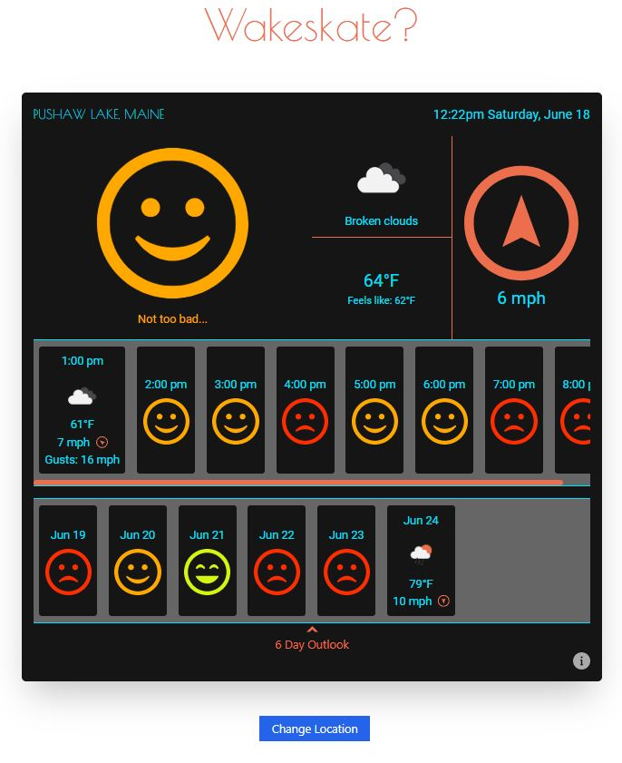

# wakeskate-web-2

Ember application that displays hourly and daily water skiing conditions.

## Table of Contents

- [Introduction](#introduction)
- [Links](#links)
- [Screenshot](#screenshot)
- [Highlights](#highlights)
- [Prerequisites](#prerequisites)
- [Installation](#installation)
- [Running / Development](#running--development)
- [Code Generators](#code-generators)
- [Running Tests](#running-tests)
- [Linting](#linting)
- [Building](#building)
- [Further Reading / Useful Links](#further-reading--useful-links)

## Introduction

This application retrieves weather data for the location selected by the user and rates weather conditions for water skiing. I built this to help my family determine the best time and day to go water skiing in Maine, but I intend to expand the geographic scope in the future.

## Links

- Github - [https://github.com/LanceStasinski/Website-client](https://github.com/LanceStasinski/Website-client)
- Deployed - [https://wakeskate.herokuapp.com/](https://wakeskate.herokuapp.com/)
- Server Source Code - [https://github.com/LanceStasinski/wakeskate-server](https://github.com/LanceStasinski/wakeskate-server)

## Screenshot

## Highlights

- SPA built with Ember
- App style and responsive design implemented with Tailwind CSS
- Location chosen using Google Maps API
- Weather data from the Open Weather Map API
- Location saved in local storage to reduce steps taken by the user upon reloading the app

## Prerequisites

You will need the following things properly installed on your computer.

- [Git](https://git-scm.com/)
- [Node.js](https://nodejs.org/) (with npm)
- [Ember CLI](https://cli.emberjs.com/release/)
- [Google Chrome](https://google.com/chrome/)

## Installation

- `git clone <repository-url>` this repository
- `cd wakeskate-web-2`
- `npm install`

## Running / Development

- `ember serve`
- Visit your app at [http://localhost:4200](http://localhost:4200).
- Visit your tests at [http://localhost:4200/tests](http://localhost:4200/tests).

### Code Generators

Make use of the many generators for code, try `ember help generate` for more details

### Running Tests

- `ember test`
- `ember test --server`

### Linting

- `npm run lint`
- `npm run lint:fix`

### Building

- `ember build` (development)
- `ember build --environment production` (production)

## Further Reading / Useful Links

- [ember.js](https://emberjs.com/)
- [ember-cli](https://cli.emberjs.com/release/)
- Development Browser Extensions
  - [ember inspector for chrome](https://chrome.google.com/webstore/detail/ember-inspector/bmdblncegkenkacieihfhpjfppoconhi)
  - [ember inspector for firefox](https://addons.mozilla.org/en-US/firefox/addon/ember-inspector/)
- [Open Weather Map API](https://openweathermap.org/api)
- [Google Maps API](https://mapsplatform.google.com/)
